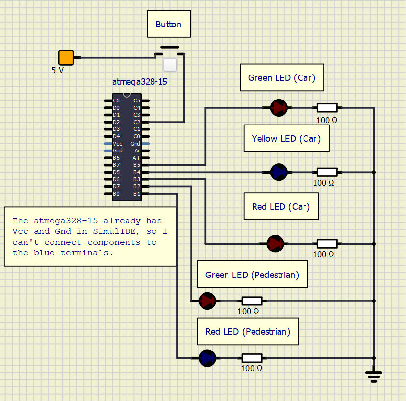

# Lab 3: VALENTIN CRISTEA

Link to your `Digital-electronics-2` GitHub repository:

   https://github.com/CristeaValentin/Digital-electronics-2


### Data types in C

1. Complete table.

| **Data type** | **Number of bits** | **Range** | **Description** |
| :-: | :-: | :-: | :-- | 
| `uint8_t`  | 8 | 0, 1, ..., 255 | Unsigned 8-bit integer |
| `int8_t`   | 8 | -127, ..., 128 | Signed 8-bit integer |
| `uint16_t` | 16 | 0, ..., +65535 | Unsigned 16-bit integer |
| `int16_t`  | 16 | -32768, ..., +32767 | Signed 16-bit integer |
| `float`    | 32 | -3.4e+38, ..., 3.4e+38 | Single-precision floating-point |
| `void`     | 0 | No range | Empty data type |


### GPIO library

1. In your words, describe the difference between the declaration and the definition of the function in C.
   * Function declaration - tells the compiler about a function's name, return type, and parameters.
   * Function definition - provides the actual body of the function.

2. Part of the C code listing with syntax highlighting, which toggles LEDs only if push button is pressed. Otherwise, the value of the LEDs does not change. Use function from your GPIO library. Let the push button is connected to port D:

```c
/* First we set the LEDs ports as output ports
after that we make one low and one high*/
GPIO_config_output(&DDRB, LED1);
GPIO_write_low(&PORTB, LED1);

 GPIO_config_output(&DDRC, LED2);
 GPIO_write_high(&PORTC, LED2);
//Here we have configured the button.
 GPIO_config_input_pullup(&DDRD, BUTTON);
 while (1)
 {
 _delay_ms(BLINK_DELAY);
if (GPIO_read(&PIND, BUTTON) == 0)
{
    //this switches between high and low
GPIO_toggle(&PORTB, LED1);
GPIO_toggle(&PORTC, LED2);
}
 }
 // Will never reach this
 return 0;
   }
```


### Traffic light

1. Scheme of traffic light application with one red/yellow/green light for cars and one red/green light for pedestrians. Connect AVR device, LEDs, resistors, one push button (for pedestrians), and supply voltage. The image can be drawn on a computer or by hand. Always name all components and their values!

   
